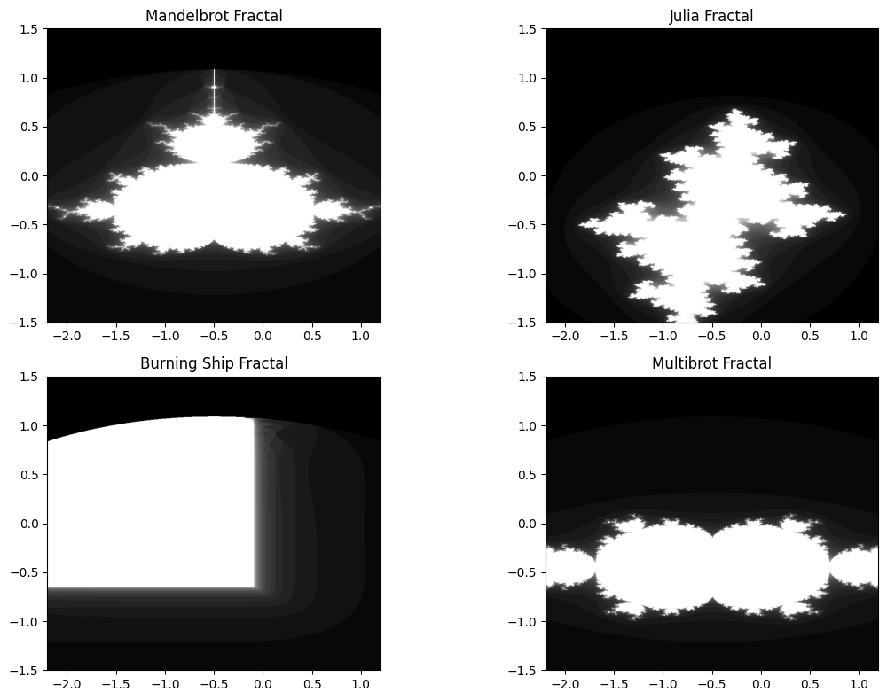

# Fractal Plotter

The Fractal Plotter is a Python script that generates and plots Mandelbrot, Julia, Burning Ship, and Multibrot fractals in a single graph. Explore the mesmerizing world of fractals with ease and simplicity.

## Usage

To use the Fractal Plotter:

1. Clone the repository to your local machine.
2. Ensure you have Python installed on your system along with the required libraries (Taichi, NumPy, and Matplotlib).
3. Run the `fractal_plotter.py` script.
4. The script will generate the fractal patterns and display them in a single graph with four subplots.

## Description

The `fractal_plotter.py` script defines a `FractalPlotter` class that generates the fractal patterns using Taichi for computational efficiency. It provides methods to render the Mandelbrot, Julia, Burning Ship, and Multibrot fractals. These fractals are then plotted together in a single graph using Matplotlib.

## Repository Structure

- `fractal_plotter.py`: The main Python script containing the `FractalPlotter` class and its methods.
- `README.md`: This README file providing information about the repository and usage instructions.
- `fractals.png`: Image file showing the generated fractal patterns.

## License

This project is licensed under the MIT License. Feel free to use and modify the code as needed.

## Author

This project is authored by Muhammad Wasay. If you have any questions or suggestions, feel free to reach out.

